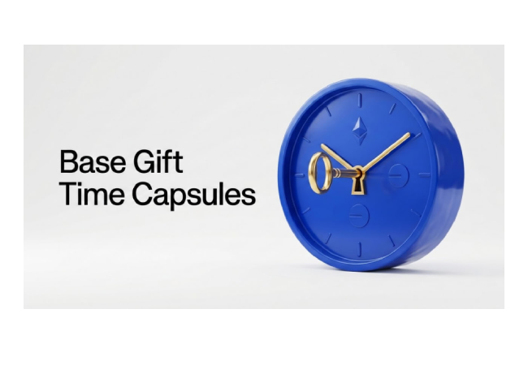
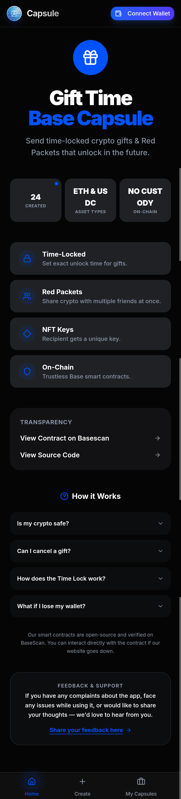
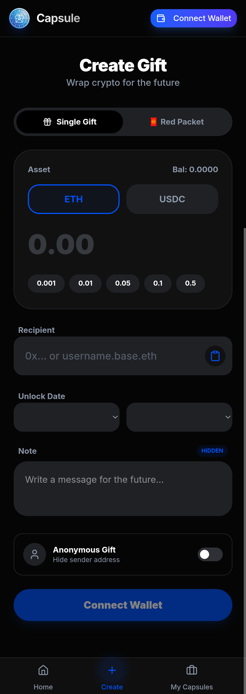
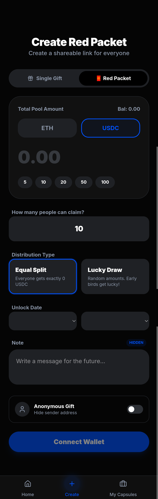
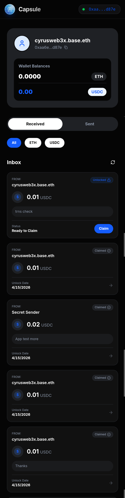
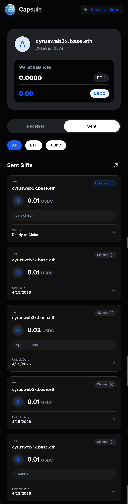

# 🎁 Base Capsule

> A Time Capsule Gift Mini-App built on the Base ecosystem.

**Base Capsule** lets you send time-locked crypto gifts to anyone on Base — gifts that stay sealed until the exact moment you choose. Whether it's a birthday surprise, a future milestone, or just a thoughtful gesture, your gift waits patiently on-chain until it's time.

🌐 **Live App:** [basecapsule.space](https://www.basecapsule.space)  
📱 **Base App:** [base.app/app/basecapsule.space](https://base.app/app/basecapsule.space)

---

## ✨ Features

### 🔒 Time-Locked Gifts
Send ETH or USDC to someone, locked until a future date and time you set. The recipient can't open it early — not even peek at your hidden message. When the moment arrives, the gift unlocks and they can claim it on-chain.

### 🧧 Red Packets
Inspired by the tradition of giving, Red Packets let you drop crypto rewards for multiple people at once. Create a shareable link, set a total pool, choose equal split or lucky draw — and let your friends race to claim their share.

### 💌 Hidden Messages
Every gift comes with a personal note that stays encrypted until unlock. Your words are part of the gift.

### 🖼️ NFT Keys
Recipients receive a unique NFT as proof of their gift — a digital keepsake that lives on Base forever.

### 🕵️ Anonymous Mode
Want to keep the mystery? Send anonymously and let the recipient wonder who cared enough to send.

### ⛓️ Fully On-Chain
No middlemen. No custodians. Everything runs on a smart contract deployed on Base Mainnet — trustless, transparent, and verifiable by anyone.

### 🔗 Base Username Support
Send gifts directly to Base usernames like `username.base.eth` — no need to copy-paste wallet addresses.

---

## 🛠️ Tech Stack

| Layer | Technology |
|-------|-----------|
| Frontend | Next.js 14, React, TailwindCSS |
| Blockchain | Base Mainnet (EVM) |
| Smart Contract | Solidity |
| Wallet | ethers.js, MetaMask / Base Wallet |
| Identity | Base ENS, OnchainKit |
| Deployment | Vercel |

---

## 🖼️ App Screenshots

  
  
  
  
  

  

---

## 🔐 Security

Base Capsule is built with a security-first approach. Your funds are protected by multiple layers:

| Feature | Details |
|--------|---------|
| ♻️ ReentrancyGuard | All functions protected against reentrancy attacks |
| ⏳ Emergency Delay | 3-day mandatory timelock before any emergency withdrawal |
| ⏸️ Pausable | Emergency stop mechanism for critical situations |
| 🔑 Ownership | `renounceOwnership` permanently disabled — contract always has an owner |
| 📖 Open Source | Fully transparent — every line of code is public |
| ✅ Verified Contract | Verified and readable on Basescan |

> **Trust math, not promises.**  
> Even the contract owner cannot instantly access user funds.  
> Everything is enforced by code on Base Mainnet.

- 📄 [View Verified Contract on Basescan](https://basescan.org/address/0xc160E1b43203A4d18E4069437Bc960248f91d847#code)

---

## 🔍 Transparency

This project is fully open source and verifiable.

- 📄 [View Smart Contract on Basescan](https://basescan.org/address/0xc160E1b43203A4d18E4069437Bc960248f91d847#code)
- 💻 [View Source Code on GitHub](https://github.com/cyrusweb3x/Crypto-Gift-Time-Capsule)

---

## 📬 Feedback & Support

Have a suggestion, found a bug, or just want to say something?  
[Share your feedback here →](https://forms.gle/Kj9voqVDRHgmLN8aA)

---

## 📄 License

MIT License — feel free to learn from it, but please don't clone and redeploy as your own.

---

*Built with ❤️ on Base by [@CyrusWeb3x](https://github.com/cyrusweb3x)*
